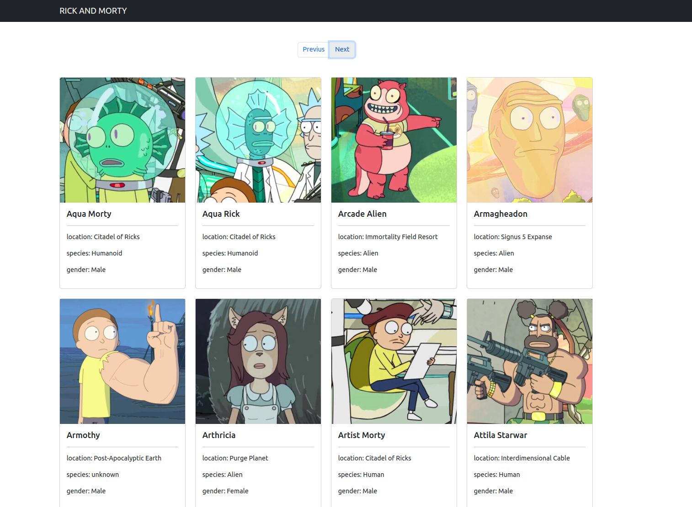

# PROYECTO RICK AND MORTY 📝

Es una página creada para que un usuario que desea conocer los detalles de la serie llamada "Rick and Morty", muestra varias cartas en las cuales se puede observar la imagen, el nombre, locación, especia y genero del personaje. 

## Comenzando 🚀

* Investigar herramientas como youtube, chrome.

### Pre-requisitos 📋

* Animos de aprender
* Paciencia

## Construido con 🛠️

* [REACT]

## Edición

Página diseñada para que el usuario conozca personajes.

## Autores ✒️❤️

* **Linda Aguilar**

## Expresiones de Gratitud 🎁

* Hecho con amor 😊❤️😊
* Muchas gracias a todos 🤓